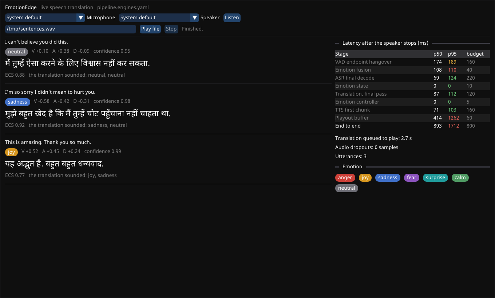

# apps/

## `emotionedge` (CLI)

```bash
emotionedge demo                      # blueprint walkthrough: synthetic angry "I can't believe you did this!" -> Hindi
emotionedge demo --conversation       # anger, sadness, joy
emotionedge demo --target es --realtime
emotionedge run --input speech.wav --script words.json   # stand-in ASR fed by a word script
emotionedge run --input speech.wav --config config/pipeline.engines.yaml   # real engines
emotionedge live                      # microphone -> speaker (build with -DEE_WITH_MINIAUDIO=ON)
emotionedge say --engine piper --model-id tts.piper.en_US.lessac.medium --text "One. | Two." --out speech.wav
                                      # test input for real ASR: '|' separates utterances (--gap seconds)
emotionedge models verify             # SHA-256 check of models/manifest.json
emotionedge stages                    # registered stage types
emotionedge serve --port 8080         # WebSocket server, one live session per connection (-DEE_WITH_WEBSOCKET=ON)
emotionedge-desktop                   # desktop app: live captions, emotion, latency (-DEE_WITH_DESKTOP=ON)
emotionedge run --input speech.wav --config config/pipeline.engines.yaml --realtime --echo-sim -6 \
    --set frontend.record=out/echo/run   # what an open loudspeaker would do, recorded
```

Echo (front end, 1.2):
- `--echo-sim DB` (with `--realtime`) feeds what is played back into the input through a
  simulated loudspeaker and room: soft clipping, `--echo-rt60-ms` of reverberation (250) and
  `--echo-delay-ms` of delay (40).
- `--set frontend.record=PREFIX` writes what the pipeline hears (`PREFIX_mic.wav`, 16 kHz). When
  audio plays, it also writes what played, aligned sample by sample with the microphone
  (`PREFIX_ref.wav`): the input an echo canceller works from.

Outputs go to `--out DIR` (default `out/<command>`):

- `translated.wav`: the translated speech.
- `mix.wav`: written with `--mix-source-db`. The original speech sits under the translation and is
  ducked while the translation plays.
- `captions.srt`: live captions with emotion tags.
- `session.json`: per-utterance transcript, emotion, MT input, translation, prosody plan, ECS and
  latency budget.
- `metrics.prom`: Prometheus text exposition.
- `trace.json`: written with `--trace`. Open it in ui.perfetto.dev.

Any setting can be overridden with `--set stage.param=value`, for example
`--set translate.engine=ct2`. `say` takes `--set tts.param=value`.

Devices:
- `--set pipeline.device=cpu` (or `cuda`, or `auto`, which the engines config uses) applies to
  every stage that does not name its own `device`.
  - `auto` uses CUDA when the build has it, and otherwise stays on the CPU without a warning.
  - `cuda`, or `auto` in a CUDA build, warns when it has to fall back to the CPU: no GPU, or
    CUDA/cuDNN libraries missing from the loader path.
- `--set emotion.acoustic_device=cuda` / `lexical_device` place a stage's two models separately.
- `--set tts.ort_profile=out/kokoro` writes ONNX Runtime's per-node profile (op, device, time),
  e.g. to find nodes that leave the GPU.
- `gpu_id` picks the GPU.

## `emotionedge serve` (WebSocket server, 5.3)

Built with `-DEE_WITH_WEBSOCKET=ON`. That fetches IXWebSocket v12.0.1 (BSD-3), pinned by SHA-256,
with no TLS or zlib.

```bash
emotionedge serve --config config/pipeline.engines.yaml --port 8080 [--host 127.0.0.1] [--max-sessions 1] [--warm 1]
python apps/web/stream_wav.py speech.wav --url ws://127.0.0.1:8080/   # reference client (pip install websockets)
```

Open `apps/web/index.html` for a browser client. It streams the microphone or a WAV file, and
shows live captions with the emotion and ECS while the translation plays. Serve the folder
(`python -m http.server -d apps/web`) if the browser refuses the microphone on `file://`.

Each connection runs one live session, the same threaded graph as `live`:
- **The speaker is the client.** The translated speech goes out at playback pace, as a sound card
  would take it, so adaptive pacing and barge-in behave as they do on a device.
- **Sessions are kept warm.** Loading a session's models takes seconds, so the server keeps
  `--warm` sessions (default 1) loaded ahead of time. A connection takes one and gets `ready` at
  once. The replacement loads when a session ends, not while one runs.

  On the real engines (jfk.wav, 6 connections per setting, interleaved):

  | Setting | `ready` after connecting | End-to-end p95 |
  |---|---|---|
  | `--warm 0` | 2.9–6.1 s | 690–729 ms |
  | `--warm 1` | 0.03–0.06 s | 628–858 ms |

  The warm medians match the cold ones, with a wider spread. Loading the replacement during the
  next session instead added 300–450 ms to the p95 of half the connections.
- **Sessions are never reused.** A session learns its speaker: the voice print, the emotion
  state, the closed-loop correction. When the connection ends, its session is discarded.
- **Memory:** each session holds its own models, about 3 GB of GPU memory. `--max-sessions`
  refuses connections beyond the limit; warm sessions come on top of it. `--warm 0` loads on
  connect instead.

The protocol on `ws://HOST:PORT/?rate=16000`, where `rate` is the client's sample rate (sessions
run at 16 kHz; the server resamples other rates):

| Direction | Frame | Content |
|---|---|---|
| client → server | binary | mono 16-bit little-endian PCM at `rate` |
| client → server | text | `{"type": "end"}`: no more speech; finish, play out, then `done` |
| server → client | text | `{"type": "ready", input_rate, output_rate, source_language, target_language}` once the models are loaded. Audio sent earlier is buffered, up to 30 s |
| server → client | text | one event per result, each with `type` and `utterance`: `transcript` (partial and final), `emotion` (V·A·D, label, confidence, emphasis), `translation` (drafts and the final), `prosody` (the controller's plan), `consistency` (ECS and what 5.2 heard, per clause), `playout` |
| server → client | text | `{"type": "done", "session": {...}}`: the session export, after the last audio. Or `{"type": "error", message}` |
| server → client | binary | the translated speech: mono 16-bit little-endian PCM at `output_rate` (24 kHz), in 10 ms blocks. Silence is not sent |

Measured through the server on the real engines (RTX 5070 Ti), the server's own end-to-end
telemetry matches in-process runs ([docs/benchmark.md](../docs/benchmark.md)):

| Input | End to end through the server | In-process benchmark |
|---|---|---|
| jfk.wav | p50 373 ms, p95 610 ms | p50 381–389 ms, p95 628–647 ms |
| 3 back-to-back sentences | p50 877 ms, p95 1655 ms | p50 844–893 ms, p95 1648–1687 ms |

The client saw 360–442 ms from the end of an utterance to its first translated audio, where no
earlier translation was still playing.

Limits:
- **Plain `ws://`, no authentication**, listening on localhost by default. Put a TLS-terminating
  proxy in front of it before exposing it.
- **A client that stops reading** stalls its own session's playback.

## `emotionedge-desktop` (desktop app, 5.3)



One window with the pipeline in-process:
- the captions: what was said, the emotion read from the voice (label and V·A·D), the Hindi as
  it is drafted and then finalized, and the ECS of the speech that played, with the emotion each
  clause sounded like;
- the latency budget, live: p50 and p95 per stage against the blueprint's budget, the
  translation queued to play, and dropouts;
- the microphone and speaker, and Listen / Play file / Stop.

Built with `-DEE_WITH_MINIAUDIO=ON -DEE_WITH_DESKTOP=ON`. It needs the X11 development headers
(apt: `libx11-dev libxrandr-dev libxinerama-dev libxcursor-dev libxi-dev`). Wayland desktops,
WSLg included, run it through XWayland.

```bash
emotionedge-desktop --config config/pipeline.engines.yaml        # then Listen, or Play file
emotionedge-desktop --input speech.wav --mute --screenshot shot.png  # render one frame and exit
```

Hindi needs text shaping: vowel signs reorder and consonants join into conjuncts. Dear ImGui
does not do that. So HarfBuzz 14.5.1 (MIT) shapes each caption, and the glyphs are rasterized
by index into a texture ImGui draws from (`apps/desktop/shaped_text.cpp`). Dear ImGui v1.92.9b
(MIT), GLFW 3.5.1 (zlib) and HarfBuzz are fetched at pinned, hash-verified versions. So is Noto
Sans Devanagari (SIL Open Font License 1.1), the font for both scripts; the build puts its
license next to it.

`--screenshot` renders into a hidden window and saves a frame, by default one second after the
session ends. That is how the UI is checked without a person at the screen. CI runs it under
Xvfb on the stand-in engines and keeps the image. The microphone path is the same as
`emotionedge live`; it was not exercised for this change.

## Planned (roadmap phase 5 "Ship")

- **gRPC** next to the WebSocket API, for typed clients.
- **Android and Jetson** builds.
